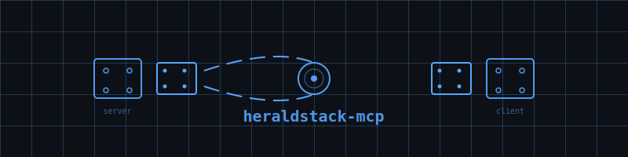

  

# heraldstack-mcp

Unified MCP tooling library for the HeraldStack. Single source of truth for launcher scripts, dockerfiles, and platform-specific MCP configs across shannon (Claude Code), haunting (kiro-cli), and gander (goose-cli).

## status

public

## what this is

- Launcher scripts organized by domain (`launchers/`) — dispatchers for qdrant, valkey, jaeger, context7, web research, code mapping, security scanning
- Dockerfiles for MCP server images (`dockerfiles/`) — baked qdrant, valkey, jaeger, context7
- Canonical platform MCP configs (`configs/`) — synced to each CLI repo (.mcp.json, .kiro/settings/, .goose/config.yaml)
- Registry schema and migration documentation (`docs/`)

## architecture

Central `registry.yaml` catalogs all launchers: name, runtime, platform wiring, health status. Cross-platform path resolution handles Linux/macOS differences. Bridge launchers use `supergateway` to proxy stdio to persistent HTTP endpoints. All launchers versioned, tested, deployed via single registration point

## related repos

- `haunting-kiro-cli` — Kiro-cli agent definitions (pulls from heraldstack-mcp)
- `shannonclaudecodecli` — Claude Code agent definitions (pulls from heraldstack-mcp)
- `heraldstack-infra` — persistent backing services, MCP HTTP adapters
- `heraldstack-core` — knowledge base, utilities, ingest tooling
- `gandergoosecli` — Goose runtime (pulls from heraldstack-mcp)

---

built by [bryan chasko](https://github.com/BryanChasko) with the [heraldstack](https://github.com/BryanChasko/heraldstack-core) agent collective
